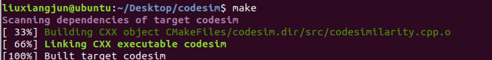
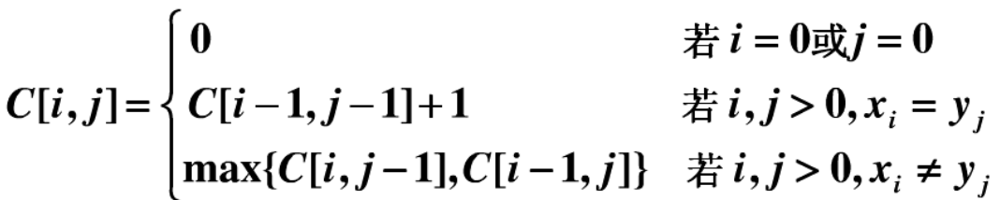
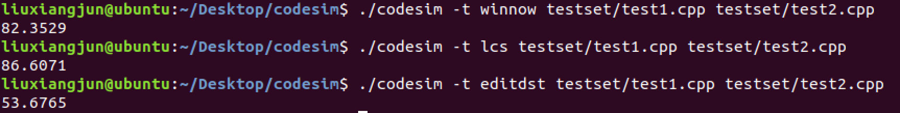
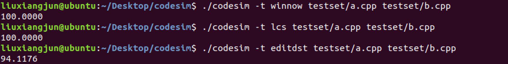
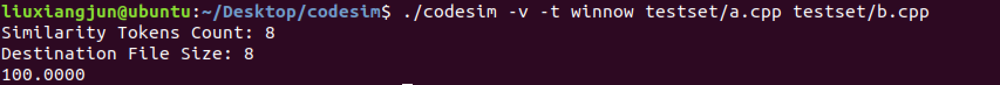
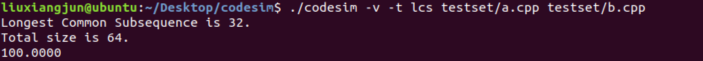
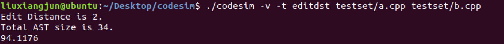

## Codesim 编译说明及运行结果

### 一、实验环境

- Ubuntu 18.04

- 实验所需依赖
  - `libllvm6.0`
  - `libclang-6.0-dev`
  - 安装方式：`sudo apt-get install libllvm6.0 libclang-6.0-dev`
- 安装cmake
  - `sudo apt-get install cmake `
  - CMakeLists.txt中定义cmake版本为3.10.2

### 二、实验过程

- 构建并编译项目
  - `cmake CMakeLists.txt`
  
  - `make`
  
  - CMakeLists.txt 和 Config.cmake 参考 Github 上前人的项目
  
    
  
    
图1. 构建项目

### 三、算法

- **Winnow - Local Fingerprinting Algorithm**（参考论文 Schleimer, Saul, Daniel S. Wilkerson, and Alex Aiken. "Winnowing: local algorithms for document fingerprinting." *Proceedings of the 2003 ACM SIGMOD international conference on Management of data*. 2003.）

- **Longest Common Subsequence Algorithm**

  使用动态规划方法，可简单表示如下：

  

- **Edit Distance Algorithm**

### 四、实验结果

**codesim [-v|--verbose] [-h|--help] [-t|--type] lcs|editdst|winnow code1 code2**

- `./codesim -h`

  

图2. -h|--help 指令

- `./codesim -t winnow testset/test1.cpp testset/test2.cpp`

  `./codesim -t lcs testset/test1.cpp testset/test2.cpp`

  `./codesim -t editdst testset/test1.cpp testset/test2.cpp`

  - 定义 -t 来选择算法的类型，winnow 代表 Local Fingerprinting Algorithm 算法，lcs 代表 Longest Common Subsequence 算法，editdst 代表 Edit Distance 算法。 

    **不输入 -t 的参数，则默认是winnow。**

  

  
图3. -t|--type 指令，测试文件为test1.cpp和test2.cpp

  

  
图4. -t|--type 指令，测试文件为a.cpp和b.cpp

- `./codesim -v -t winnow testset/test1.cpp testset/test2.cpp ` 

  `./codesim -v -t lcs testset/test1.cpp testset/test2.cpp `

  `./codesim -v -t editdst testset/test1.cpp testset/test2.cpp `

  - 定义 -v 能够输出不同算法计算的相似代码的长度以及相应测试文件的总长度。

  

  
图5. -v|--verbose指令，使用winnow

  
  
  
图6. -v|--verbose指令，使用lcs

  
  
  
  
图7. -v|--verbose指令，使用editdst

​      